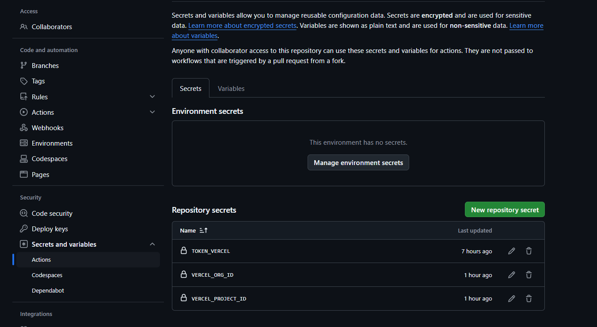
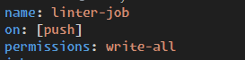
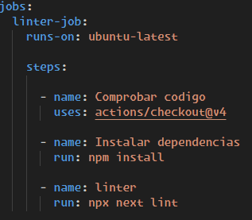
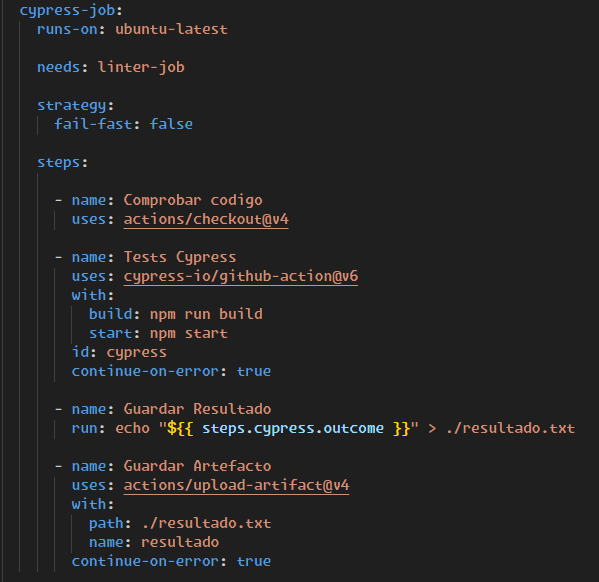
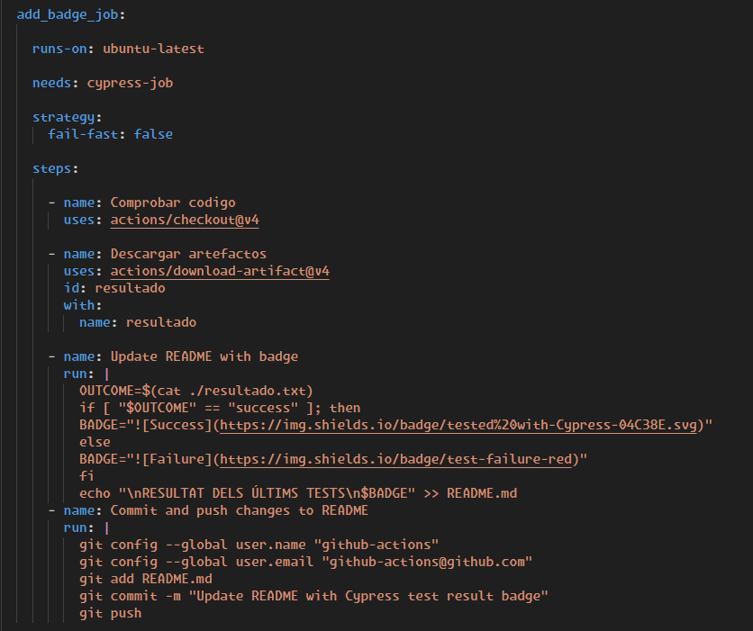
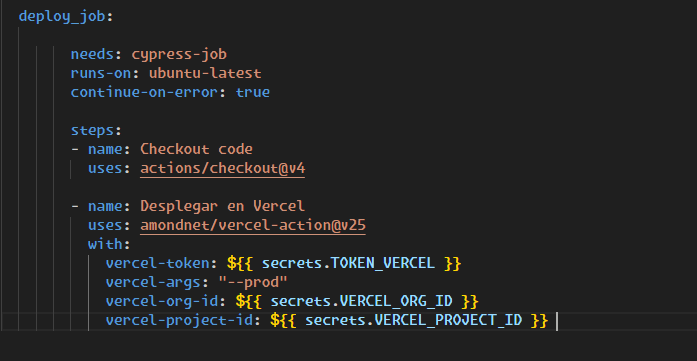
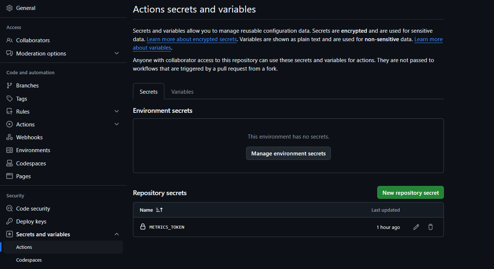
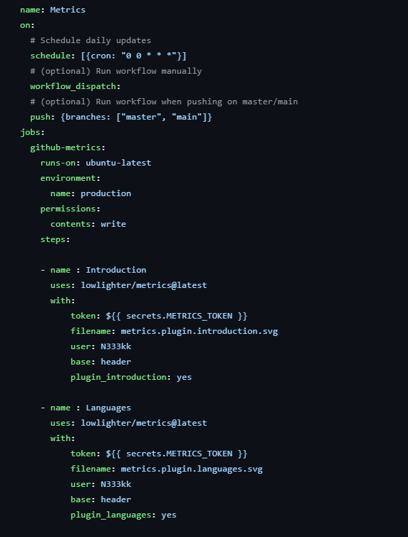

Example of nextjs project using Cypress.io

<!---Start place for the badge -->

<!---End place for the badge -->
RESULTAT DELS ÚLTIMS TESTS\n

GitHub Actions
----

Las GitHub Actions son una herramienta de integración continua y entrega continua (CI/CD) que permite automatizar flujos de trabajo directamente desde el repositorio de GitHub. Con GitHub Actions, puedes crear y ejecutar flujos de trabajo que se activan en eventos específicos, como push, pull request, o en un horario programado.

### Componentes de una GitHub Action

1. **Eventos (Events)**: Son los desencadenantes que inician un flujo de trabajo. Ejemplos incluyen `push`, `pull_request`, y `schedule`.

2. **Trabajos (Jobs)**: Un flujo de trabajo puede contener uno o más trabajos que se ejecutan en paralelo o en secuencia. Cada trabajo se ejecuta en un entorno de ejecución (runner).

3. **Pasos (Steps)**: Cada trabajo se compone de pasos que se ejecutan secuencialmente. Los pasos pueden ejecutar comandos o usar acciones predefinidas.

4. **Acciones (Actions)**: Son comandos reutilizables que se pueden usar en los pasos de un trabajo. GitHub proporciona un marketplace de acciones que puedes usar en tus flujos de trabajo.

---

### Crear un workflow

Antes de empezar con el workflow como tal vamos a empezar por crear los secretos que vamos a necesitar para nuestro workflow, para ello iremos a los settings de nuestro repositorio y una vez alli iremos al apartado de secretos y variables

En nuestro caso tenemos los Tokens de vercel para poder hacer el deploy de nuestro repositorio

---

Ahora si, empezamos con el workflow

Como podemos ver, para empezar tenemos tres instrucciones:

- **Name** : Nos permite asignar un nombre a nuestro workflow.
- **On** : Nos premite asignar en que momento se ejecutara el workflow.
- **Permissions** : Nos permite indicar que permisos tendra nuestro workflow sobre el repositorio.

### Linter Job

Aqui podemos observar el codigo de nuestro linter job, para empezar usamos una action de github para comprobar nuestro codigo, una vez hecho esto, usamos run para lanzar un comando, en este caso npm install para instalar las dependencias del proyecto y una vez terminado este paso, ejecutamos el linter.

---

### Cypress Job

Este job como podemos ver incluye una instruccion needs, la cual permite solo ejecutar esta accion si una anterior da un resultado positivo, por lo que esta no se ejecutara si el linter ha fallado, por otro lado tambien incluye la instruccion fail-fast:false, la cual nos permite seguir con el workflow aunque este trabajo falle.

Este job empieza haciendo checkout al codigo igual que el anterior y luego sigue con una action de cypress la cual se ejecutara despues de hacer un build del proyecto y iniciarlo, como podemos ver, este apartado incluye la instruccion continue-on-error: true, lo cual indica que aunque este apartado de error seguiremos con la ejecucion del action. Despues de esto guardaremos el resultado mediante steps.cypress.outcome, esto nos permite referenciar un paso anterior y guardar datos que este aporte.

Para terminar con este job guardamos el artefacto que hemos generado anteriormente mediante una action de github para poder usarlo mas tarde.

----

#### Add Badge Job

En este job vamos a ejecutar un script para analizar el resultado de el artifacto que hemos creado en el paso anterior y posteriormente asignar el badge correcto a nuestro ReadMe, una vez hecho esto configuraremos git y haremos un push con los cambios correspondientes

----

#### Deploy Job

Este ultimo job incorpora una instruccion needs, que se asegura de que el cypress-job este completo para ejecutarse, en este job usaremos los secretos que hemos configurado al principio de todo para poder hacer el deploy de nuestro repositorio en vercel, haciendo uso de la accion custom de vercel con los parametros que vemos en las instrucciones dentro del with:

----

#### Añadir metricas a nuestro perfil

Para terminar vamos a crear otro repositorio con nuestro nombre de usuario, este repositorio es especial y se muestra cuando entramos a nuestro perfil

Una vez creado el repositorio crearemos un nuevo secreto en este repositorio con un token de github que tenga acceso a los permisos necesarios para nuestras metricas.

Una vez hecho esto, creamos nuestro workflow, en mi caso he usado el siguiente codigo:

Como podemos ver, tenemos instrucciones como schedule, que nos permite ejecutar este workflow en un tiempo determinado o workflow_dispatch, que nos permitiria hacerlo de forma manual en caso de necesitarlo.

En mi caso, solo he incorporado un plugin de introduccion basico y uno de los lenguajes mas usados, una vez ejecutado el workflow, solamente he usado el segundo ya que los dos aportaban datos muy similares

